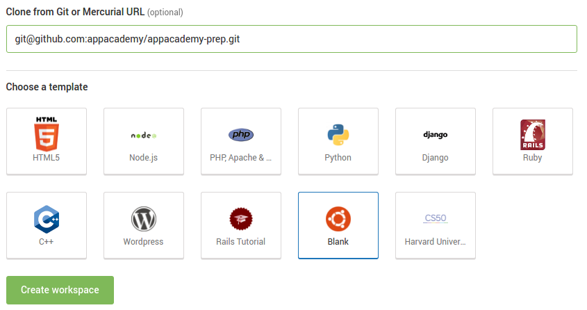

# Cloud9

[Cloud9][cloud9] will be our environment of choice for programming
during App Academy Prep. It has many of the same features as more
powerful desktop editors like Sublime Text or Atom, along with a
built-in terminal and robust support for collaboration.

### Registration

We encourage you to create your Cloud9 account using your Github account.
To do so, head to [Cloud9][cloud9] and click the little Github icon next to
the Sign In button in the top right. This will automate some nice integrations
with Github, and has the nice side effect of allowing us to more easily find
your workspace.

If you already have a Cloud9 account, you can still connect to Github by
going to Settings > [Connected Services][services].

[cloud9]: https://c9.io/
[services]: https://c9.io/account/services
[repos]: https://c9.io/account/repos

### Creating your workspace

Once you've integrated your Github account with Cloud9, it's super easy
to get your workspace set up. Head to your Workspaces page, and create
a new one. You should see something like this:

Name your workspace "appacademy-prep" and choose the **Blank** option.
Where it says "Clone from Git or Mercurial URL", please enter
`git@github.com:appacademy/appacademy-prep.git`.
Once you've filled out the form, click the "Create workspace" button.
If your new workspace doesn't contain the contents of the repo, ensure
that you connected Cloud9 to your Github account properly and try again.

Once you've entered the workspace, the basic workflow will be:

0. Navigate through folders and files using the sidebar on the left.
0. Write your Ruby code in the text editor, top and center.
0. Run your code in the terminal at the bottom.

All of the readings in this repo are markdown files (.md). If you'd like
to read them in Cloud9, right-click them and select "Preview".

The terminal behaves almost exactly as it would on a Mac. You can
install gems and run the programs you've written with commands like
`ruby hello_world.rb` This will allow you to see any output and error
messages produced by your program.

### Settings

You'll find that Cloud9 has good support for customization; you can
tweak the color scheme, window arrangement, and such to your heart's
content. Before you start working, please take the time to apply the
following settings. Our office workstations are configured to use these
options, and we feel this is the most sensible configuration for Ruby
development.

#### View (accessible from the top navigation bar)
* Wrap Lines: on
* Wrap to Print Margin: on

#### Preferences (under Cloud9, or by pressing `CMD + ,`)
##### Project Settings > Code Editor (Ace)
* Soft Tabs: 2 spaces

##### Settings > User Interface
* Use an Asterisk (\*) to Mark Changed Tabs: on

##### Settings > Code Editor (Ace)
* Auto-pair Brackets, Quotes, etc.: on
* Wrap Selection with Brackets, Quotes, etc.: on
* Highlight Active Line: on
* Highlight Gutter Line: on
* Show Gutter: on
* Show Print Margin: on, set to 80
