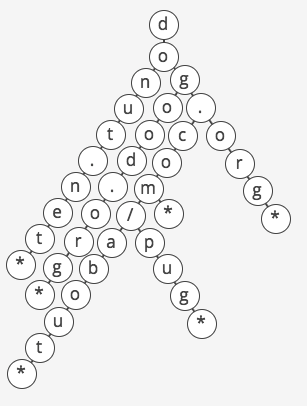

# Partner A interviews Partner B
This interview has one question, a whiteboarding question.

Please spend no more than 25 minutes in answering the whiteboarding question. **Set a timer.**

Remember to score your partner throughout the interview so that you have concrete, constructive feedback at the end during the debrief. Treat this like a real interview!

At the end of the 25 minutes interview, spend 5 minutes debriefing.

## Whiteboarding (25 minutes)
I wrote a crawler that visits web pages, stores a few keywords in a database, and follows links to other web pages. I noticed that my crawler was wasting a lot of time visiting the same pages over and over, so I made a set, `visited`, where I'm storing URLs I've already visited. Now the crawler only visits a URL if it hasn't already been visited.

Thing is, the crawler is running on my old desktop computer in my parents' basement (where I totally don't live anymore), and it keeps running out of memory because visited is getting so huge.

How can I trim down the amount of space taken up by `visited`?

### Solution
(Problem and solution taken from Interview Cake)

Notes for the interviewer:
* The interviewee's strategy shouldn't take a hit on runtime.
* Be sure that the interviewee not only discusses potential solutions, but also actually codes out and implements the potential solution. (ie. They should not only be able to tell you to use a trie, but also code up an implementation of a trie.)
* If the interviewee is stuck for an extended period of time, then feel free to suggest a trie data structure. If they are unfamiliar with what a trie is, then give them a brief example/picture of one, and then see if they can implement it. (but don't give things away too soon; let them struggle for a little bit first!)
* Do not allow the interviewee to give up on the problem before the 25 minutes time limit. If they are super stuck, remind them that interviewers care just as much about how well you communicate while you struggle as how well you communicate when you know the answer.

#### Naive Solution
Replacing common substrings like `.com` and `www` with characters that aren't allowed in URLs definitely wins us something, but we can do even better. How can we even further exploit overlaps or shared prefixes between URLs?

Notice that a boatload of URLs start with `www.`.

We could make visited a nested hash where the outer key is the subdomain and the inner key is the rest of the URL, so for example `visited['www.']['google.com'] = true` and `visited['www.']['interviewcake.com'] = true`. Now instead of storing the `www.` for each of these URLs, we've just stored it once in memory. If we have 1,000 URLs and half of them start with `www.` then we've replaced 500 * 4 characters with just 4 characters in memory.

But we can do even better.

What if we used this same approach of separating out shared prefixes recursively? How long should we make the prefixes?

What if we made the prefixes just one character?

#### Optimal Solution
We can use a trie. If you've never heard of a trie, think of it this way:

Let's make visited a nested hash where each map has keys of just one character. So we would store `google.com` as `visited['g']['o']['o']['g']['l']['e']['.']['c']['o']['m']['*'] = true`.

The `*` at the end means *'this is the end of an entry'*. Otherwise we wouldn't know what parts of visited are real URLs and which parts are just prefixes. In the example above, `google.co` is a prefix that we might think is a visited URL if we didn't have some way to mark *'this is the end of an entry.'*

Now when we go to add `google.com/maps` to visited, we only have to add the characters `/maps`, because the `google.com` prefix is already there. Same with `google.com/about/jobs`.

We can visualize this as a tree, where each character in a string corresponds to a node. To check if a string is in the trie, we just descend from the root of the tree to a leaf, checking for a node in the tree for each character of in string.



The above image is a trie containing `donut.net`, `dogood.org`, `dog.com`, `dog.com/about`, `dog.com/pug`, and `dog.org`.

How could we implement this structure? There are lots of ways! We could use nested hashes, nodes and pointers, or some combination of the two. Evaluating the pros and cons of different options and choosing one is a great thing to do in a programming interview.

In our implementation, we chose to use nested hashes. To determine if a given site has been visited, we just call `check_present_and_add()`, which checks if a given string is present in the trie and adds it to the trie if it's not.

```ruby
class Trie

  def initialize
      @root_node = {}
  end

  def check_present_and_add(word)

      current_node = @root_node
      is_new_word = false

      # Work downwards through the trie, adding nodes
      # as needed, and keeping track of whether we add
      # any nodes.
      word.each_char do |char|
          if !current_node.key? char
              is_new_word = true
              current_node[char] = {}
          end
          current_node = current_node[char]
      end

      # Explicitly mark the end of a word.
      # Otherwise, we might say a word is
      # present if it is a prefix of a different,
      # longer word that was added earlier.
      if !current_node.key? "End Of Word"
          is_new_word = true
          current_node["End Of Word"] = {}
      end

      return is_new_word
  end
end

```
**Partial walk-through of the above solution**
1. We first initialize a Trie, which then sets an empty hash as the `@root_node`.
2. Let's add `donut.net` to the trie. In that first loop, we iterate over each character of `donut.net`:
    * `current_node` initially is just the empty hash `@root_node`. Since `current_node` does not have 'd' as one of the keys, it toggles `is_new_word` to true, and then sets 'd' as a key pointing to an empty hash as the value: `{ 'd' => {} }`.
    * Then, `current_node = current_node[char]` sets the `current_node` to equal to the value of key 'd', which is an empty hash.
3. On the next char, 'o', since it's not found in `current_node`, it adds the key 'o' in `current_node` pointing to an empty hash as the value.

**I highly recommend that you slowly walk through adding a few words to the Trie, while keep track of what the Trie looks like with its nested hashes, as well as the value of `current_node`.** During the debrief, if your interviewee was confused about how to implement this, please do this detailed walkthrough together.

#### Complexity
How much space does this save?

How many characters were we storing in our flat hash approach? Suppose `visited` includes all possible URLs of length 5 or fewer characters. Let's ignore non-alphabetical characters to simplify, sticking to the standard 26 English letters in lowercase. There are 26^5 different possible 5-character URLs (26 options for the first character, times 26 options for the 2nd character, etc), and of course 26^4 different possible 4-character URLs, etc.
If we store each 5-character URL as a normal string in memory, we are storing 5 characters per string, for a total of 5 * 26^5 characters for all possible 5-character strings (and 4 * 26^4 total characters for all 4-character strings, etc). So for all 1, 2, 3, 4, or 5 character URLs, our total number of characters stored is:

(5 * 26^5) + (4 * 26^4) + (3 * 26^3) + (2 * 26^2) + (1 * 26^1)
​​
So for all possible URLs of length `n` or fewer, our total storage space is:

n26^n + (n-1)26^(n-1) + . . . + 1*26^1
​​
This is O(n26^n).

How many characters are stored in our trie? The first layer has 26 nodes (and thus 26 characters), one for each possible starting character. On the second layer, each of those 26 nodes has 26 children, for a total of 26^2 nodes. The fifth layer has 26^5 nodes. To store all 1, 2, 3, 4, or 5 character URLs our trie will have 5 layers. So the total number of nodes is:

26^5 + 26^4 + 26^3 + 26^2 + 26^1

So for all URLs of length `n` or fewer, we have:

26^n + 26^(n-1) + ... + 26^1
​​
This is O(26^n). We've shaved off a factor of `n`.

For time complexity of looking up the url, you might be thinking that since you now have to traverse the trie to see if a url exists, the O(n) where `n` is the length of the url. However, although the HTTP spec allows for unlimited URL length, in practice many web browsers won't support URLs over 2,000 characters. This puts a constant bound on our runtime, and therefore the time complexity of looking up whether a url exists in our trie is still constant.

#### What We Learned
We ended up using a trie. Even if you've never heard of a trie before, you can reason your way to deriving one for this question. That's what we did: we started with a strategy for compressing a common prefix ("www") and then we asked ourselves, "How can we take this idea even further?" That gave us the idea to treat each character as a common prefix.

That strategy—starting with a small optimization and asking, "How can we take this same idea even further?"—is hugely powerful. It's one of the keys to unlocking complex algorithms and data structures for problems you've never seen before.
