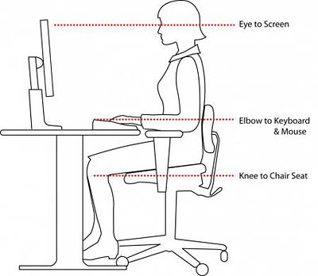

# Ergonomics
  It's no secret: at App Academy we work a lot, and most of that work is
done using a mouse and keyboard. Unfortunately poor posture and
positioning of your computing tools can lead to painful conditions like
Repetitive Stress Injury (RSI), including Carpal Tunnel Syndrome.

  We at App Academy want to ensure that all students get to enjoy a long 
and fulfilling career in the computing industry. An injury sustained
early in your career could slow your momentum entering the industry, so
we encourage you to be proactive in treating your body well. Below, we
outline a few key guidelines to ensure your sustained comfort, health,
and productivity.

### Look out for early symptoms

  If you have any pain, discomfort, numbness, or tingling in the wrist,
fingers, or forearm, **do not** push through it while continuing to work.
Stop and take measure to address your egonomics, and if it persists,
consult a doctor. **Take it seriously.**  If symptoms of RSI are showing,
the damage has already accumulated a considerable amount. We had a student
recently who had tolerable symptoms and ignored them for just a few weeks,
and had to drop out of his cohort and come back 7 weeks later because the
pain suddenly became too much to type.

### Minimize typing away from the desk

  Using the computer, especially typing, in your bed or on the couch is
very rough on your wrists and should be avoided, as the awkward position
of your wrists puts significantly more strain on your tendons. Doing the
rails tutorial in bed and on couches is what started the aforementioned
student's problems.

### Monitor Height

  It is suggested that a monitor's top be around eye level. If you feel
discomfort based on your monitor's height we can provide you with
materials to raise the monitor at your request.

### Desk/Seat Height

  The desk should be around your belly button for proper elbow
positioning. If your desk is too high or low, use the lever on your
chair to adjust it's height. If this is still inadequate, please discuss
this issue with your instructor.

### Posture
  
  Keep your back straight. Rounding can lead to fatigue and injury. If
you require extra lumbar support, you may use a lumbar pillow or a
rolled towel. Unfortunately, App Academy does not have these products to
offer students, but affected students are encouraged to bring their own
to ensure their comfort.

### Wrist Alignment

  Occasionally certain keyboards can be poor fits for individual's
anatomy. The keyboards we provide are widely used in the industry, but
they may not be a perfect for you. If you find the
keyboard is inducing discomfort, we encourage you to find and bring in a
keyboard that is a better fit. We are happy to allow you to use your own
keyboard, mouse, or chair if they will better accommodate you.

### Diagram

### Resources
[Apple Ergonomics
Guide](http://www.apple.com/about/ergonomics/index.html)
