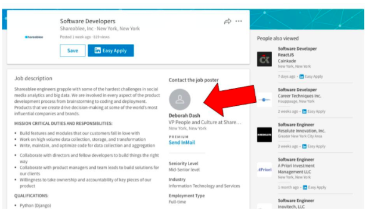
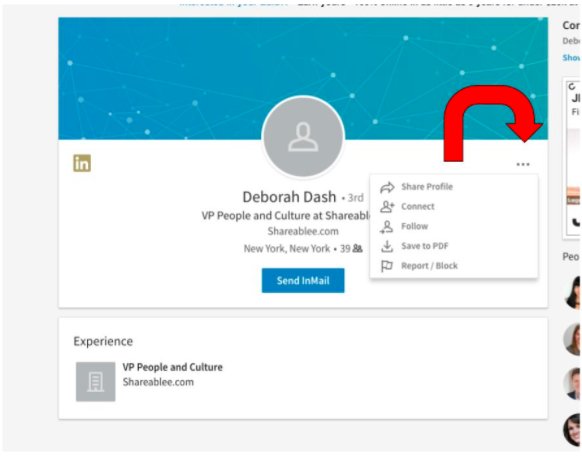
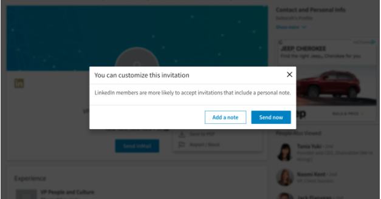

# Phase 0: Motivation

Hate it or love it, proactively growing the size of your network will benefit you both personally and professionally; your network is your net worth. Increasing the size of your personal and professional network can lead to a variety of opportunities, including side projects, industry involvement, and a new job! :) This is an important skillset to develop as you progress in your career.

## Warm up

Before diving into the networking pool, take this [quick survey] to determine whether or not you are an introvert or an extrovert. We’ll use the results to inform our strategy moving forward.

[quick survey]: https://www.buzzfeed.com/alexfinnis/are-you-more-of-an-introvert-or-an-extrovert

# Phase 1: Preparation

Leveraging your networking strengths will increase your success. People usually identify with being either an introvert or extrovert. Each offer strengths and strategies which will increase your success in connecting and building relationships that lead to job opportunities.

## Extroverts

These folks gain energy from others. They shine in group discussions, having knowledge on a range of topics, and thrive for interaction and activity. Extroverts strive for quantity in relationships; how large and vast can I grow my network? Extroverts talk to think, and are good at engaging in conversation with just about everyone. They are not afraid to exchange and promote projects, other people (and themselves), and ideas in both a personal and professional setting.

## Introverts

These folks gain energy from time spent on their own. They shine in one-on-one discussion, delving into areas of expertise. Introverts strive for quality; they focus on a few people and make them their priority. They focus their attention on others and display strong listening skills. Introverts think to talk, and will tend to create a plan before interacting with folks in a personal and professional setting. After an event, they will systematically follow up and may spend time in reflection. 

## Personal brand

When approaching networking, remember to own which of these styles suits you best. It’s important to be you, and no one else. People can quickly read when someone is “faking it.” Your networking style should be reflected across all of your job search/networking sites.

### Tips for Networking Success

Practice in front of a mirror. You think it’s awkward to speak to people you don’t know? Wait until you see yourself talk in front of a mirror! This is GREAT for perfecting your level of comfort in speaking with new people. 
Smile! Smiling triggers a positive mood. 

# Phase 2: So, what do you actually talk about with other people?

You’re now aware of your networking strengths and skillsets, you’ve entered the room/venue, and have made contact with another attendee; now what? For most people, this is where the fear kicks in, more specifically the fear of rejection. A few things to remember:

Be the first person. When we wait for others to go first, no one ends up going.
People are genuinely nice and aren’t assholes, especially those who may be attending an event for similar reasons.
Use your strengths! Introverts and extroverts can be successful in the networking area. 
High risk, high reward. You never know who you are going to meet.

So, how do you actually open conversation with someone? Some easy-to-implement tips are:

* Say Hello! Don’t overthink it. To make it easier, look for someone by themselves.
* Give a compliment. This could be about someone's clothes, a sticker on their laptop, an item they're using, etc. Remember to keep this in good taste; nothing inappropriate!
* Discuss the event you are attending.
* Ask for advice. 

Check out some of these conversation-starting resources:

* [30 Brilliant Networking Conversation Starters](https://www.themuse.com/advice/30-brilliant-networking-conversation-starters)
* [8 Networking Conversation Starters that Work Every Time](https://www.themuse.com/advice/8-networking-conversation-starters-that-work-every-time)
* [25 Networking Conversation Starters that Never Fail](https://theundercoverrecruiter.com/networking-conversation-starters-never-fail/)

### Open-Ended Questions

You exchange names and what you do, now what? Having some go-to questions will be really important while networking. We encourage you to ask open-ended questions; they maximize information collection. This is easily done by asking “how” or “what“ questions. 

* “How did you hear about the event?
* “How’s your day going?”
* “What do you do for work?”

(Although they are not how/what questions, I always like to ask people if they like what they do; people don’t expect it, and sometimes are pleasantly surprised at their answers!)

Use these resources to your advantage for good questions to ask at an event:

* [Ask these 14 Questions to Stand Out at Every Event](https://www.themuse.com/advice/ask-these-14-questions-to-stand-out-at-every-event-you-attend)

**DON'T FORGET - Your story plays a huge role when networking!**

# Phase 3: Follow up

As you’ve heard throughout the job search curriculum, follow up is a vital part of networking. Following up with people you meet is important and a main tenant to building strong, lasting relationships. Following up is the difference between making friends with new people and having a nice one-off conversation. These messages are usually sent through text, email, LinkedIn, and in some cases, a hand-written note. 

Below is a very basis follow-up template to get you started:

```
“Hi {Insert contact name},

I hope this finds you well. It was great meeting you at {insert event title and location}. *{Insert something memorable you talked about.} 

**{Make ask}

Thank you very much for your time and I look forward to keep in touch. 

Sincerely,

{Your Name}
```

*Think back to something you discussed during your conversation; this could shared interests and experiences, professional and career development articles, or anything of the like. Take a moment to refresh their memory.

**Make the asks. Some “asks” you could make are:
Ask for help, or offer help. If your follow-up is not job related, one way to develop trust with other professionals is to help them solve a problem. 
“I found the (insert job) role at your company, and I’d like to find some time to learn more about your (insert company name) experience. Can we grab coffee/set up a call to talk?
I saw that you know (insert person’s name at X company) who works at (X company). Working as a dev there is my dream; could you introduce me to them?

Here are some more resources to add to consider:

* [How to Follow Up After a Networking Event with Examples](https://www.thebalance.com/follow-up-letter-to-a-contact-met-at-a-networking-event-2063486)
* [Finally, Five Email Templates that make Following Up with Anyone Less Awkward](https://www.themuse.com/advice/finally-5-email-templates-that-make-following-up-with-anyone-way-less-awkward)

# Phase 4: LinkedIn/AngelList/Job Networking Sites

Both introverts and extroverts can be successful using tools like LinkedIn and AngelList. After you set up your pages, it’s time to get to work and start connecting! The LinkedIn repo reviews “warm” outreach - connecting with people through your current connections. Here, we will focus on “cold” outreach - connecting with someone who you do not already have a connection with. The below information is mainly geared towards LinkedIn; however, it can also be applied to a variety of networking tools. 

### Who are you actually connecting with?

You will be looking to put yourself in front of three different types of people:

* Recruiters: Folks that are specifically hired by companies to find talent (like yourself!) to bring into their company.
* Hiring Managers: Folks that are usually leading dev teams, and may be the actual manager to roles you will be applying for.
* C-Level Individuals: Folks who are leading the vision of company. In your case, you’re looking for the CTO, or Chief Technical Officer, of the company. 

### How does this actually work?

When you search for job opportunities on LinkedIn, input your criteria, and find an opportunity you’d like to consider. Let’s say one of them is below:



Underneath “Contact the Job Seeker,” You will find the person with whom you will want to connect. Some job postings don’t have this information filled in; we encourage you to open up a new LinkedIn tab, and search for “ X company Recruiter/Tech Lead/CTO.” 

Here is where you would be inclined to click “send inMail”. In order to send inMail messages, you must pay for LinkedIn. Their Career plan costs $29.99 per month, however, they do offer a free month trial. Please note that this is not a sales pitch to invest in LinkedIn’s Career tool. If you choose to do so, please be aware of the cost that comes with the resource.

So, how do you get around this?

Click on the job poster’s image or name; this will take you to their profile. There is usually a blue button which says “Connect” (just like the “Send inMail” bar in the image below). When that bar isn’t available, click on the three dots, and from the dropdown menu choose “connect.” 



From there, you will have the opportunity to “add a note to customize your invitation to connect:




When writing your note, consider these points:
* Keep it short and sweet: people are going to spend only a few seconds reading this!
* Figure out what do you want from them: Are you looking to speak with them about an opportunity? Learn more about what’s like to work at their company?
* Ask for what you want: You won’t get what you don’t ask for. Make sure to ask for a 15-20 minute call or an in-person meeting. More than likely, people will agree more quickly to a call. 

Check out some of these other resources on Cold Outreach:

* [How a Simple LinkedIn Message that took 2 Minutes to Write Landed me My Dream Job](https://www.themuse.com/advice/how-a-simple-linkedin-message-that-took-2-minutes-to-write-landed-me-my-dream-job)
* [The Perfect LinkedIn Message: A Complete Guide](https://blog.beamery.com/linkedin-messages/)

# Phase 6: Review

Introverts and Extroverts are successful at networking,
Be yourself, and no one else. People can spot fakers a mile away.
Have a plan. How many people do you want to talk to? Who specifically do you want to talk with?
Have questions ready to ask.
Follow up after an event, and keep it short and concise. This can be via email, text, LinkedIn, or another tool. 
